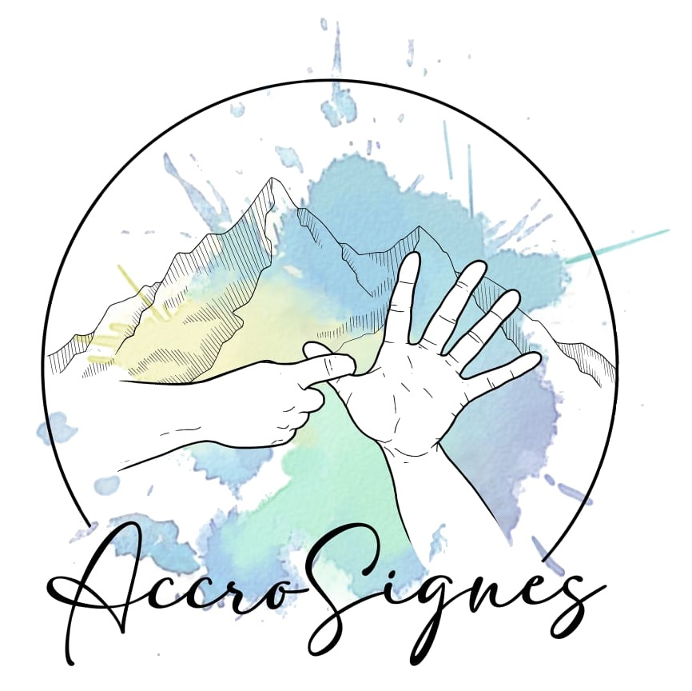

# Accrosignes

Accrosignes est une association Grenobloise qui propose des cours de langue des signes française et des rencontres entre sourds et entendants.



## Conception en cours

Je propose la conception de ce site bénévolement, le projet est en cours.

## Regard technique

### Architecture

Application Next.js 15 avec TypeScript, structurée selon les principes d'un design atomique et d'une architecture hexagonale :

```
app/              Routes Next.js (App Router)
  actualites/     Page des actualités
  agenda/         Calendrier des événements
  cours-de-lsf/   Cours de langue des signes
  espace-membre/  Espace réservé aux membres
  api/            Routes API

components/       Composants UI (Atomic Design)
  atoms/          Composants de base réutilisables
  molecules/      Combinaisons d'atomes
  organisms/      Composants complexes

features/         Logique métier par domaine
  auth/           Authentification
  news/           Gestion des actualités
  users/          Gestion des utilisateurs
  firebase/       Configuration Firebase

contexts/         Contextes React pour l'état global
public/           Assets statiques (images, logo)
```
